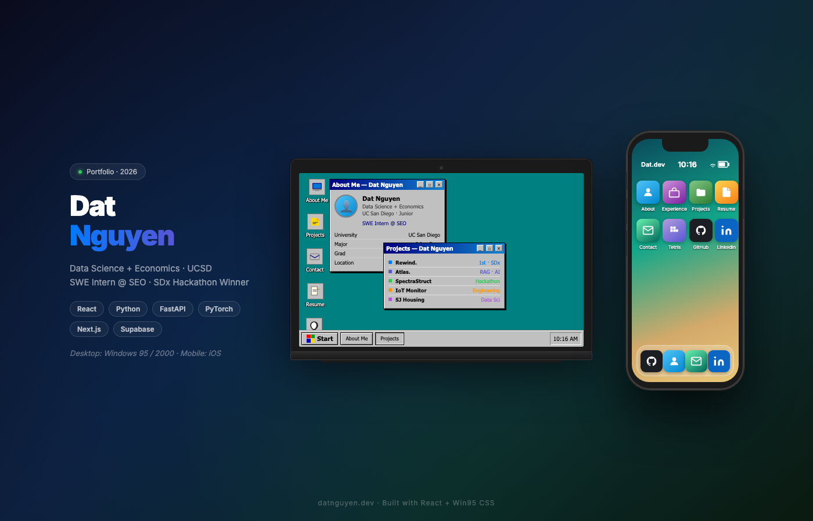

# Dat Nguyen — Portfolio

[Live portfolio](https://dats-nguyen.vercel.app) · [GitHub](https://github.com/Da0t) · [LinkedIn](https://www.linkedin.com/in/datnguy3n/)

An interactive portfolio for Dat Nguyen, a UC San Diego Data Science and Economics student building reliable fintech, data, and full-stack systems.



## What makes it different

The desktop experience behaves like a compact Windows 95/2000 environment instead of a conventional landing page. Visitors can open, drag, resize, minimize, and maximize app windows; select desktop icons; use a contextual menu; run the Windows Update theme flow; and play Minesweeper.

Mobile intentionally becomes a different product: a skeuomorphic early-iPhone interface with touch-first app navigation and Tetris. Both experiences render the same verified profile, experience, skills, and project data from one shared module.

## Featured work

The portfolio is curated for fintech and software-engineering applications:

1. [Northstar](https://github.com/Da0t/northstar) — a local-first financial planning lab with 5,000 seeded monthly Monte Carlo paths, a Web Worker execution boundary, fees/inflation modeling, downside metrics, and fixed-path funding solvers.
2. [QuotaSignal](https://github.com/Da0t/quota-signal) — a local-first CRM and explainable bookings-forecasting workbench with relationship validation, integer financial arithmetic, atomic CSV exchange, and an optional seeded deal simulation.
3. [Rewind](https://github.com/pynay/rewind) — a first-place SDx Hackathon agent-session replay and branching tool. This link points to the team repository.
4. [Pylon / Lattice](https://github.com/Da0t/Lattice) — a second-place Bow Capital Hackathon counter-UAV mesh with terrain-aware visualization, RF anomaly detection, and UDP gossip.
5. [Aside AI](https://github.com/Da0t/AsideAI) — a first-place Berkeley AI Hackathon Deepgram-track wearable narration system.
6. [Windows Portfolio](https://github.com/Da0t/Portfolio-Website) — this desktop/mobile interface and its OS-inspired interaction model.

Northstar and QuotaSignal are educational decision-support projects. Their modeled outcomes are not financial advice, calibrated predictions, or guarantees.

## Architecture

```text
src/data/portfolioData.js
  ├── desktop windows (about, experience, projects, resume)
  └── mobile apps (about, experience, projects, resume, contact)

src/App.jsx
  └── Windows desktop shell, window state, icon state, themes

src/mobile/MobileLayout.jsx
  └── early-iPhone shell, home screen, app navigation
```

Key implementation choices:

- React 18 and Vite for the single-page application
- Vanilla CSS for the Windows and early-iPhone design systems
- `react-draggable` for controlled desktop window movement
- Separate desktop and mobile shells instead of a compressed desktop layout
- Shared content data to prevent profile drift between layouts
- Static deployment with no analytics, authentication, backend, or visitor-data collection

## Repository map

```text
src/
├── App.jsx                       # Desktop orchestration and window state
├── data/portfolioData.js         # Shared verified content
├── components/                   # OS shell, taskbar, dialogs, update flow
├── windows/                      # Desktop app content
├── mobile/                       # Mobile shell, app content, Tetris
├── hooks/useMobile.js            # Layout boundary
└── index.css                     # Windows theme tokens and primitives
public/
├── Dat_resume.pdf                # Current downloadable resume
├── portfolio-preview.png         # Repository and social preview
├── projects/                     # Authentic project screenshots
└── icons/                        # Windows-inspired icon assets
```

## Run locally

Requirements: Node.js 18+ and npm.

```bash
npm install
npm run dev
```

Vite prints the local URL. To verify the production bundle:

```bash
npm run build
npm run preview
```

## Updating content

- Edit `src/data/portfolioData.js` for profile, experience, skills, resume projects, or portfolio projects.
- Replace `public/Dat_resume.pdf` when the resume changes.
- Store project screenshots in `public/projects/` and reference them from the shared project record.
- Keep desktop and mobile presentation logic separate; shared facts should remain in the data module.
- Run `npm run build` before committing.

## Design direction

Desktop follows the repository's Windows 95/2000 rules: fixed system colors, sharp raised/sunken borders, bitmap-era typography, and functional motion only. Mobile follows its own early-iPhone rules: Aqua gloss, pinstripe surfaces, grouped lists, and touch-sized controls. See [DESIGN.md](DESIGN.md) for the complete design system.

## Contact

Dat Nguyen · [datq.nguyen06@gmail.com](mailto:datq.nguyen06@gmail.com)

UC San Diego · B.S. Data Science & B.A. Economics · Expected June 2028
